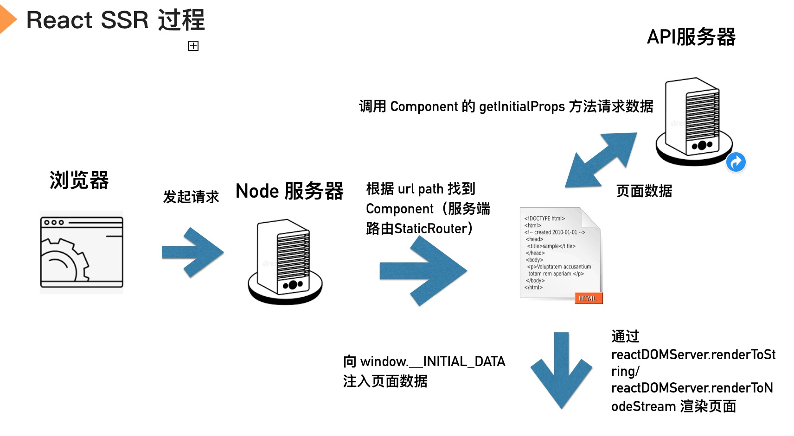
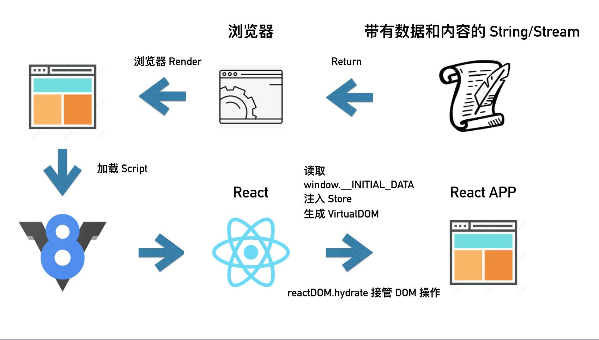

### react SSR
SSR: Server Side Render 服务端渲染
实际上是客户端渲染和服务器端渲染的一个整合。我们把页面的展示内容和交互写在一起，让代码执行两次。在服务器端执行一次，用于实现服务器端渲染，在客户端再执行一次，用于接管页面交互
渲染流程如下图：


### 重点的API
```
ReactDOM.hydrate(element, container[, callback])
```
> Same as render(), but is used to hydrate a container whose HTML contents were rendered by ReactDOMServer. React will attempt to attach event listeners to the existing markup 
[more>](https://reactjs.org/docs/react-dom.html#hydrate)

hydrate是 React 中提供在初次渲染的时候，去复用原本已经存在的 DOM 节点，减少重新生成节点以及删除原本 DOM 节点的开销，来加速初次渲染的功能 并向已经存在的dom节点绑定事件
#### 路由
```
<staticRouter />   
```
[StaticRouter]((https://reacttraining.com/react-router/web/api/StaticRouter)) 是 React-Router 针对服务器端渲染专门提供的一个路由组件

在服务器端需要通过请求路径，找到路由组件，而在客户端需通过浏览器中的网址，找到路由组件，是完全不同的两套机制，所以这部分代码是肯定无法公用,在客户端使用`<BrowserRouter />`在服务端使用`<staticRouter />  `

### react-ssr-simple
项目中是一个简单的react ssr
执行`npm i` 然后再执行 npm run build 打包react文件，然后执行npm run dev 启动
### 推荐
优酷的React + Egg +SSR框架：http://ykfe.net/
### 参考链接
https://www.jianshu.com/p/1ff3632056e1

https://zhuanlan.zhihu.com/p/45529730
